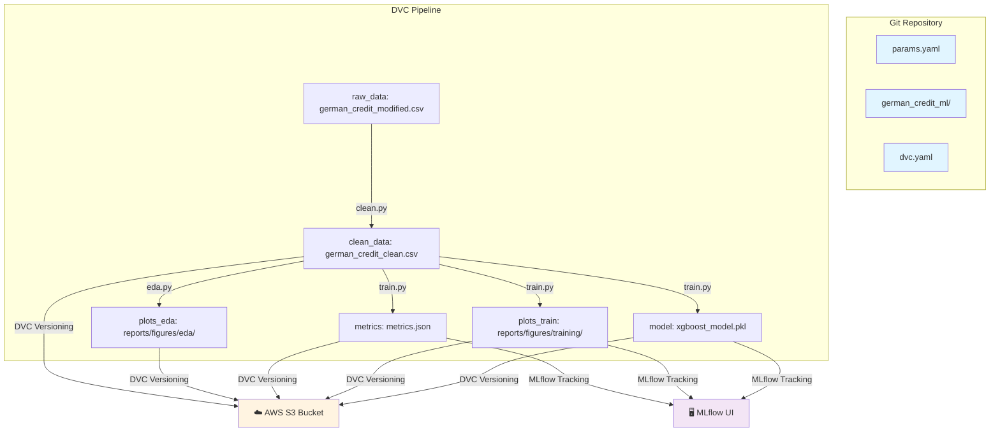

# 💳 Credit Risk MLOps - German Credit Dataset

\<div align="center"\>

**MLOps Team 46 - Proyecto de Clasificación de Riesgo Crediticio**

[](https://www.python.org/downloads/)
[](https://mlflow.org/)
[](https://dvc.org/)
[](https://aws.amazon.com/s3/)
[](https://streamlit.io/)

[](https://www.google.com/search?q=%23-uso-del-pipeline-automatizado)
[](https://www.google.com/search?q=%23-instalaci%C3%B3n)

\</div\>

-----

## 📋 Tabla de Contenidos

  - [Sobre el Proyecto](https://www.google.com/search?q=%23-sobre-el-proyecto)
  - [Información Académica](https://www.google.com/search?q=%23-informaci%C3%B3n-acad%C3%A9mica)
  - [Arquitectura del Pipeline](https://www.google.com/search?q=%23-arquitectura-del-pipeline)
  - [Estructura del Proyecto](https://www.google.com/search?q=%23-estructura-del-proyecto)
  - [Requisitos Previos](https://www.google.com/search?q=%23-requisitos-previos)
  - [Instalación](https://www.google.com/search?q=%23-instalaci%C3%B3n)
  - [Uso](https://www.google.com/search?q=%23-uso)
      - [Uso del Pipeline Automatizado](https://www.google.com/search?q=%23-uso-del-pipeline-automatizado)
      - [Tracking de Experimentos con MLflow](https://www.google.com/search?q=%23-tracking-de-experimentos-con-mlflow)
      - [Ejecución Manual de Etapas (DVC)](https://www.google.com/search?q=%23-ejecuci%C3%B3n-manual-de-etapas-dvc)
      - [Aplicación de Predicción (Streamlit)](https://www.google.com/search?q=%23-aplicaci%C3%B3n-de-predicci%C3%B3n-streamlit)
  - [Flujo de Contribución](https://www.google.com/search?q=%23-flujo-de-contribuci%C3%B3n)
  - [Equipo](https://www.google.com/search?q=%23-equipo)

-----

## 🎯 Sobre el Proyecto

Este repositorio contiene la implementación completa de un sistema MLOps para la clasificación de riesgo crediticio utilizando el dataset "German Credit". El proyecto integra las mejores prácticas de la industria para asegurar la reproducibilidad y la colaboración.

  - 📊 **Versionado de datos y modelos** con DVC.
  - 🔄 **Pipelines reproducibles** con DVC que automatizan la limpieza, el análisis (EDA) y el entrenamiento.
  - 📈 **Seguimiento de experimentos** con MLflow para registrar métricas, parámetros y artefactos.
  - ☁️ **Almacenamiento en la nube** con AWS S3 para los artefactos de DVC.
  - 🤖 **Entrenamiento de un modelo XGBoost**, incluyendo interpretabilidad con SHAP.
  - 💡 **Aplicación interactiva** con Streamlit para realizar predicciones en tiempo real.
  - 🏗️ **Estructura de proyecto modular** y escalable.

-----

## 📘 Información Académica

**Instituto Tecnológico y de Estudios Superiores de Monterrey** *Maestría en Inteligencia Artificial Aplicada (MNA)*

  - **Curso:** Operaciones de Aprendizaje Automático (MLOps)
  - **Periodo:** Septiembre – Diciembre 2025
  - **Equipo:** N° 46

### 👨‍🏫 Profesores

| Rol | Nombre |
|---|---|
| Titular | Dr. Gerardo Rodríguez Hernández |
| Titular | Mtro. Ricardo Valdez Hernández |
| Asistente | Mtra. María Mylen Treviño Elizondo |
| Tutor | Dr. José Carlos Soto Monterrubio |

-----

## 🏗️ Arquitectura del Pipeline



-----

## 📁 Estructura del Proyecto

```
├── README.md              <- Este archivo
├── params.yaml            <- Parámetros y rutas del pipeline
├── dvc.yaml               <- Definición de las etapas del pipeline DVC
├── requirements.txt       <- Dependencias del proyecto
├── run_pipeline.sh        <- Script para ejecutar el pipeline completo
│
├── data
│   ├── processed          <- Datasets limpios para modelado (Salida de DVC)
│   └── raw                <- Datos originales inmutables (Rastreado por DVC)
│
├── models                 <- Modelos entrenados y serializados (Salida de DVC)
│
├── notebooks              <- Jupyter notebooks para exploración y prototipado
│
├── reports
│   ├── figures            <- Gráficas generadas por el pipeline (Salida de DVC)
│   └── metrics.json       <- Métricas de rendimiento del modelo (Salida de DVC)
│
├── german_credit_ml/      <- Código fuente del proyecto (módulo Python)
│   ├── __init__.py
│   ├── clean.py           <- Script de limpieza de datos
│   ├── eda.py             <- Script de análisis exploratorio
│   └── modeling
│       ├── train.py       <- Script de entrenamiento de modelos
│       └── predict.py     <- Lógica de predicción
│
├── predict_app.py         <- Aplicación interactiva con Streamlit
│
├── .dvc/                  <- Configuración de DVC
└── mlruns/                <- Carpeta de tracking de experimentos de MLflow (ignorada por Git)
```

-----

## 🛠 Requisitos Previos

  - **Python 3.9+**
  - **Git**
  - **Conda** para gestión de entornos
  - **Credenciales de AWS** configuradas para acceder a S3.

-----

## 🚀 Instalación

1.  **Clonar el repositorio:**

    ```bash
    git clone https://github.com/jmtoral/mna-mlops-team46.git
    cd mna-mlops-team46
    ```

2.  **Configurar entorno de Conda:**
    Abre **Anaconda Prompt** o **Git Bash** (previamente configurado con `conda init bash`).

    ```bash
    # Activa el entorno 'mlops'
    conda activate mlops

    # Si no existe, créalo primero: conda create --name mlops python=3.9

    # Instala todas las dependencias
    pip install -r requirements.txt
    ```

3.  **Configurar DVC con AWS S3:**
    Necesitarás las credenciales de AWS.

    ```bash
    # Configura tus credenciales (reemplaza los placeholders)
    dvc remote modify --local origin access_key_id "TU_ACCESS_KEY_ID"
    dvc remote modify --local origin secret_access_key "TU_SECRET_ACCESS_KEY"
    ```

4.  **Descargar datos y modelos:**
    Este comando descarga la última versión de todos los artefactos desde S3.

    ```bash
    dvc pull
    ```

-----

## 💻 Uso

### ▶️ Uso del Pipeline Automatizado

El script `run_pipeline.sh` es la forma principal de interactuar con el proyecto. Detecta cambios y ejecuta las etapas necesarias, versionando y subiendo los resultados.

```bash
# Ejecutar el pipeline completo
bash run_pipeline.sh
```

  - **Si modificas código** (ej. `train.py`), solo ejecuta el script.
  - **Si actualizas datos crudos**, primero haz `dvc add data/raw/tu_archivo.csv` y luego ejecuta el script.

### 📈 Tracking de Experimentos con MLflow

Para visualizar y comparar tus experimentos de entrenamiento:

1.  **Inicia el servidor de MLflow:**
    ```bash
    mlflow ui
    ```
2.  **Abre tu navegador** en `http://localhost:5000`.

### ⛓️ Ejecución Manual de Etapas (DVC)

Si deseas ejecutar todo el pipeline sin los commits automáticos:

```bash
dvc repro
```

Para ver las métricas del último modelo entrenado:

```bash
dvc metrics show
```

### 💡 Aplicación de Predicción (Streamlit)

Para interactuar con el modelo y realizar predicciones en tiempo real:

1.  Asegúrate de tener el último modelo (`dvc pull` o `dvc repro`).
2.  Ejecuta la aplicación:
    ```bash
    streamlit run predict_app.py
    ```
3.  **Abre tu navegador** en la `Local URL` que te indique la terminal (ej. `http://localhost:8501`).

-----

## 🤝 Flujo de Contribución

1.  **Sincroniza tu repositorio:**

    ```bash
    git pull
    dvc pull
    ```

2.  **Crea una nueva rama:**

    ```bash
    git checkout -b feat/nombre-descriptivo
    ```

3.  **Realiza cambios y ejecuta el pipeline:**

    ```bash
    # (Edita código, actualiza datos, etc.)
    bash run_pipeline.sh
    ```

4.  **Verifica los resultados** en MLflow y los archivos generados.

5.  **Sube tus cambios** (el script ya se encarga de los `commits` y `push`).
    Si hiciste cambios adicionales (ej. en `README.md`), haz commit manualmente.

6.  **Crea un Pull Request** en GitHub a la rama `master`.

-----

## 👥 Equipo

| Integrante | Matrícula | Rol |
|---|---|---|
| Jesús Alberto Jiménez Ramos | `A01796903` | 📊 Data Engineer |
| Mónica María Del Rivero Sánchez | `A01362368` | 👩‍🔬 Data Scientist |
| Montserrat Gaytán Morales | `A01332220` | 💻 Software Engineer |
| José Manuel Toral Cruz | `A01122243` | 🤖 ML Engineer |
| Jeanette Rios Martinez | `A01688888` | 🛠️ SRE / DevOps |

-----

\<div align="center"\>
Desarrollado con ❤️ por el Equipo 46 | MNA
\</div\>